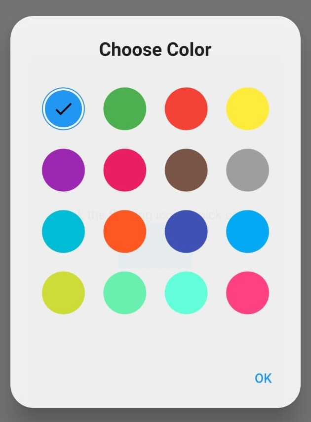
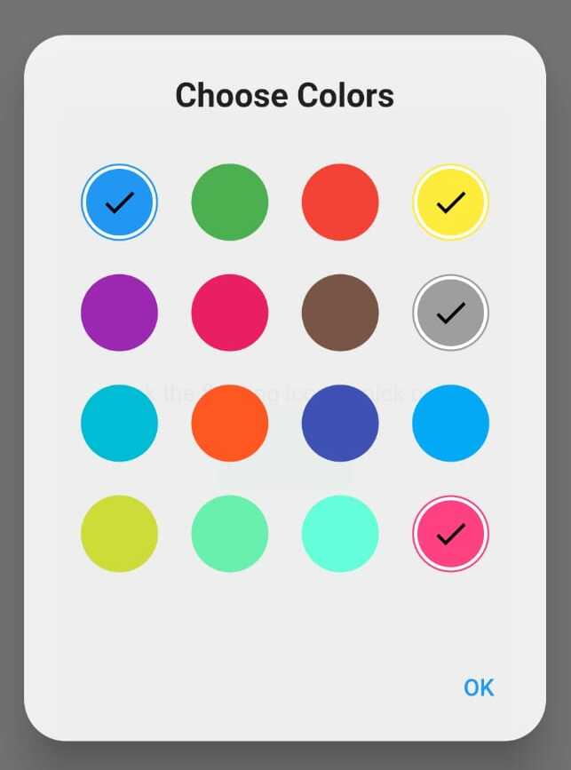

<!-- 
This README describes the package. If you publish this package to pub.dev,
this README's contents appear on the landing page for your package.

For information about how to write a good package README, see the guide for
[writing package pages](https://dart.dev/guides/libraries/writing-package-pages). 

For general information about developing packages, see the Dart guide for
[creating packages](https://dart.dev/guides/libraries/create-library-packages)
and the Flutter guide for
[developing packages and plugins](https://flutter.dev/developing-packages). 
-->

This Color picker for flutter apps provide picking facility for both single and multiple color choosing.


## Features

* Choose single color
* Choose Multiple colors

## Getting started

Just go through example to get code and make the color picker in easy way.

To pick single color




To pick multiple colors




## Usage
```dart
  Color color = Colors.white;

  List<dynamic> colorlist = [];
  
  Future<void> _picksinglecolor() async {
    color = await ColorpickerState.colorChooseSingle(context);
    setState(() {

    });
  }

  Future<void> _pickmulticolor() async {
    colorlist.clear();
    colorlist = await ColorpickerState.colorChooseMultiple(context);
    setState(() {

    });
  }

```


